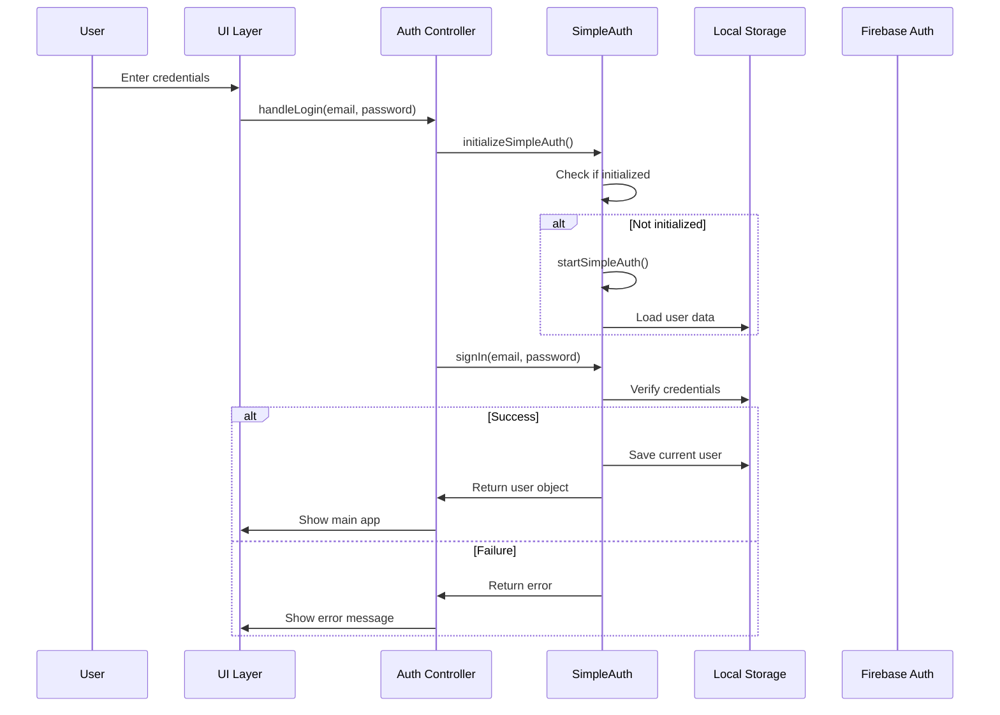
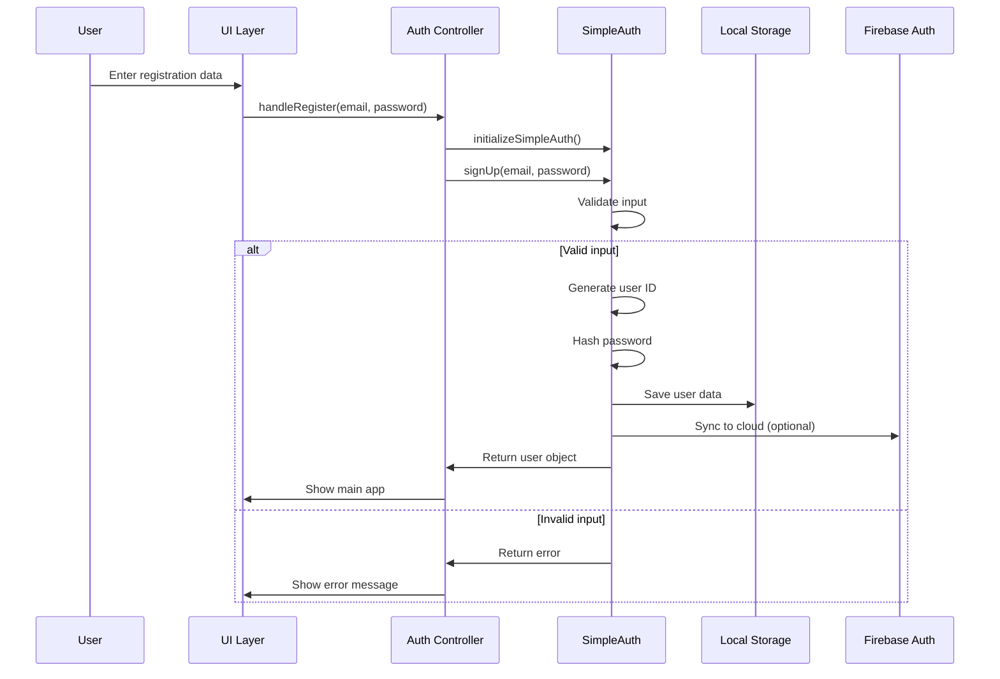

# 認証システム設計図

## 📋 システム概要

My Routine アプリケーションの認証システムは、Firebase認証とカスタムSimpleAuthの両方をサポートするハイブリッド認証システムです。

## 🏗️ システムアーキテクチャ

```
┌─────────────────────────────────────────────────────────────┐
│                    My Routine App                          │
├─────────────────────────────────────────────────────────────┤
│  ┌─────────────────┐    ┌─────────────────┐                │
│  │   UI Layer      │    │  Event Layer    │                │
│  │                 │    │                 │                │
│  │ • Login Form    │◄──►│ • Form Submit   │                │
│  │ • Register Form │    │ • Auth Events   │                │
│  │ • Main App      │    │ • State Changes │                │
│  └─────────────────┘    └─────────────────┘                │
├─────────────────────────────────────────────────────────────┤
│  ┌─────────────────┐    ┌─────────────────┐                │
│  │ Auth Controller │    │  Auth Manager   │                │
│  │                 │    │                 │                │
│  │ • handleLogin   │◄──►│ • initializeAuth│                │
│  │ • handleRegister│    │ • checkAuthState│                │
│  │ • logout        │    │ • syncAuth      │                │
│  └─────────────────┘    └─────────────────┘                │
├─────────────────────────────────────────────────────────────┤
│  ┌─────────────────┐    ┌─────────────────┐                │
│  │  SimpleAuth     │    │  Firebase Auth  │                │
│  │                 │    │                 │                │
│  │ • Local Storage │    │ • Cloud Auth    │                │
│  │ • User Mgmt     │    │ • Google OAuth  │                │
│  │ • Password Hash │    │ • Real-time     │                │
│  └─────────────────┘    └─────────────────┘                │
├─────────────────────────────────────────────────────────────┤
│  ┌─────────────────┐    ┌─────────────────┐                │
│  │ Local Storage   │    │  Cloud Storage  │                │
│  │                 │    │                 │                │
│  │ • User Data     │    │ • Firestore     │                │
│  │ • Auth State    │    │ • User Sync     │                │
│  │ • App Data      │    │ • Backup        │                │
│  └─────────────────┘    └─────────────────┘                │
└─────────────────────────────────────────────────────────────┘
```

## 🔐 認証フロー図

### ログインフロー


### 新規登録フロー


## 📁 ファイル構造

```
My Routine/
├── index.html                 # メインアプリケーション
├── script-new.js             # メインJavaScript (v1.0.15)
├── simple-auth.js            # カスタム認証システム
├── simple-storage.js         # ストレージ管理
├── firebase-config.js        # Firebase設定
├── debug-auth.html           # 認証デバッグツール
└── google-drive-config.js    # Google Drive設定
```

## 🔧 コンポーネント詳細

### 1. Auth Controller (`script-new.js`)

```javascript
// 主要機能
- initializeSimpleAuth()     // 認証システム初期化
- handleLogin(email, password) // ログイン処理
- handleRegister(email, password) // 登録処理
- checkAuthState()           // 認証状態チェック
- logout()                   // ログアウト処理
```

### 2. SimpleAuth (`simple-auth.js`)

```javascript
class SimpleAuth {
    // 主要メソッド
    - init()                  // 初期化
    - signIn(email, password) // ログイン
    - signUp(email, password) // 登録
    - signOut()               // ログアウト
    - getCurrentUser()        // 現在のユーザー取得
    - isAuthenticated()       // 認証状態確認
    - createAdminUser()       // 管理者作成
    - resetPassword()         // パスワードリセット
}
```

### 3. データ構造

#### ユーザーオブジェクト
```javascript
{
    uid: "user_1234567890_abc123",
    id: "user_1234567890_abc123",     // 互換性のため
    email: "user@example.com",
    displayName: "user",
    createdAt: "2025-06-27T13:52:25.386Z",
    isAdmin: false,
    lastLogin: "2025-06-27T13:52:25.386Z"
}
```

#### 認証結果オブジェクト
```javascript
{
    success: true/false,
    user: userObject,        // 成功時のみ
    message: "エラーメッセージ"  // 失敗時のみ
}
```

## 🛡️ セキュリティ設計

### パスワードハッシュ化
```javascript
// 簡易ハッシュ（本番環境ではbcrypt等を使用）
hashPassword(password) {
    return btoa(password + '_salt');
}
```

### データ検証
```javascript
// ユーザーデータの所有権確認
isMyData(data, dataType) {
    return data.userId === currentUserInfo.id;
}
```

### 認証状態管理
```javascript
// ローカルストレージでの認証状態保存
localStorage.setItem('simpleAuthCurrentUser', JSON.stringify(user));
```

## 🔄 同期メカニズム

### ローカル ↔ クラウド同期
```javascript
// Firebase Firestoreとの同期
async syncWithCloud() {
    const db = firebase.firestore();
    const syncDoc = await db.collection('auth_sync').doc('users').get();
    // ローカルとクラウドデータをマージ
}
```

## 🐛 デバッグシステム

### デバッグツール (`debug-auth.html`)
- システム状態チェック
- 認証テスト機能
- ユーザー管理機能
- リアルタイムログ表示

### コンソールデバッグ関数
```javascript
// ブラウザコンソールで使用可能
checkAuthSystemStatus()  // システム状態確認
handleDebugAuth()        // 認証デバッグ
initializeSimpleAuth()   // 強制初期化
```

## 📊 エラーハンドリング

### エラー分類
1. **初期化エラー**: 認証システムの初期化失敗
2. **認証エラー**: ログイン/登録失敗
3. **ネットワークエラー**: クラウド同期失敗
4. **データエラー**: ローカルストレージエラー

### エラー処理フロー
```javascript
try {
    // 認証処理
} catch (error) {
    console.error('エラー詳細:', error);
    return { 
        success: false, 
        message: error.message || '予期しないエラーが発生しました' 
    };
}
```

## 🚀 パフォーマンス最適化

### キャッシュ戦略
- 認証状態のローカルキャッシュ
- ユーザーデータのメモリキャッシュ
- スクリプトのバージョン管理

### 遅延読み込み
- 必要時のみクラウド同期
- 認証システムの遅延初期化

## 🔮 将来の拡張性

### 計画中の機能
1. **OAuth統合**: Google, Facebook, GitHub認証
2. **多要素認証**: SMS, Email認証
3. **セッション管理**: 自動ログアウト
4. **監査ログ**: 認証履歴の記録

### アーキテクチャの拡張性
- プラグイン形式の認証プロバイダー
- モジュラー設計による機能追加
- APIファーストアプローチ

## 📝 実装ガイドライン

### コーディング規約
1. **エラーハンドリング**: すべての非同期処理でtry-catch
2. **ログ出力**: デバッグ情報の詳細記録
3. **型安全性**: JSDocコメントによる型定義
4. **テスト**: 各機能の単体テスト

### デプロイメント
1. **バージョン管理**: ファイル名にバージョン番号
2. **キャッシュ制御**: 適切なキャッシュヘッダー
3. **エラー監視**: 本番環境でのエラー追跡

---

## 📞 サポート情報

### トラブルシューティング
1. **キャッシュクリア**: `Ctrl+F5` (Windows) / `Cmd+Shift+R` (Mac)
2. **デバッグツール**: `debug-auth.html` を使用
3. **コンソール確認**: ブラウザの開発者ツールでログ確認

### 開発者向け情報
- **API ドキュメント**: 各関数の詳細仕様
- **サンプルコード**: 実装例とベストプラクティス
- **テストケース**: 自動テストと手動テスト手順 